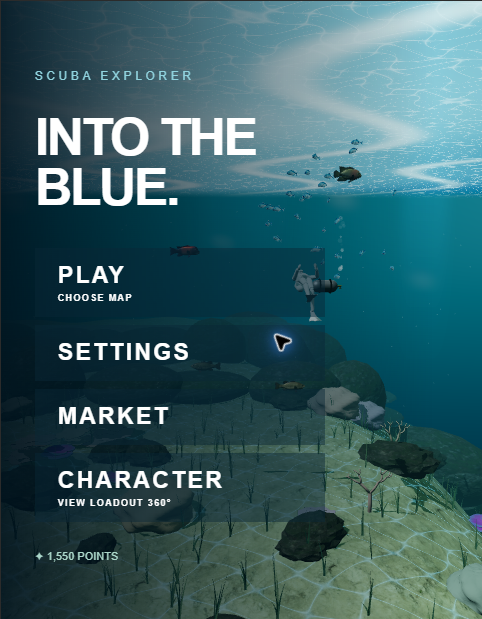

# Scuba Explorer

Scuba Explorer is a browser-based 3D diving game built with Three.js and Vite. Explore layered underwater environments, meet marine life, collect points, and customize your diver with equipment and characters.



## Run locally

Requirements: Node.js 18+ and npm.

```bash
npm install
npm run dev
```

Open the local URL printed by Vite. On Windows, `run-local.bat` performs the same setup and starts the development server.

## Build

```bash
npm run build
```

The production bundle is written to `dist/`.

## Controls

- Use the on-screen menu to start a dive, choose a map, open the market, or view your character.
- During a dive, use the keyboard controls shown in the game HUD to swim and interact with the environment.

## Project layout

- `src/` — game systems, rendering, controls, HUD, characters, encounters, and audio.
- `public/assets/` — 3D models, textures, and attribution/source notes.
- `scripts/` — small development checks for imported game assets.

## Credits

Third-party asset credits and source links are documented in [`public/assets/sea-life/ATTRIBUTION.md`](public/assets/sea-life/ATTRIBUTION.md) and [`public/assets/ocean/SOURCES.md`](public/assets/ocean/SOURCES.md).
